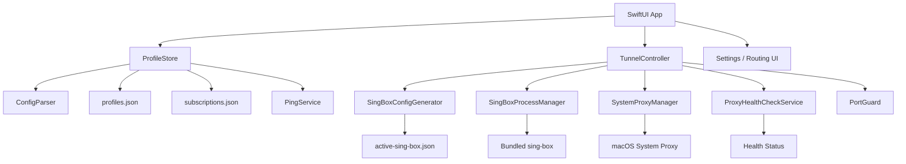
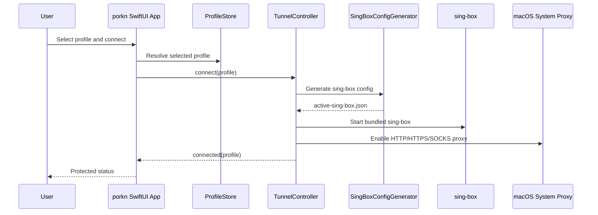

# porkn

<p align="center">
  <strong>Native macOS and Windows proxy/VPN client powered by sing-box.</strong><br>
  A custom desktop client for subscriptions, VLESS, SOCKS and Trojan profiles with system proxy integration.
</p>

<p align="center">
  <a href="https://github.com/XRS0/Porkn/releases/latest"></a>
  
  
  
  
</p>

---

## What is porkn?

**porkn** is a native macOS client for proxy/VPN-style connections. It is being developed as a custom alternative to clients such as v2RayTun, with a focus on a clean macOS experience, portable app packaging and practical subscription/profile management.

The current production mode is **System Proxy**:

1. porkn imports a proxy profile or subscription.
2. It generates a `sing-box` JSON configuration.
3. It starts the bundled `sing-box` binary inside the `.app` bundle.
4. It opens a local mixed proxy on `127.0.0.1` using a free port from `2080...2090`.
5. It enables macOS HTTP, HTTPS and SOCKS system proxy for that local endpoint.
6. On disconnect, it restores the previous system proxy settings.

Full VPN/TUN mode is planned and already has a safe skeleton, but it is **not production-ready yet** because macOS Packet Tunnel requires Apple NetworkExtension entitlement, proper signing, an extension target and notarization.

---

## Current status

The latest release is:

```text
v0.3.5
```

Release page:

```text
https://github.com/XRS0/Porkn/releases/tag/v0.3.5
```

Available release artifacts:

```text
porkn-macos-arm64.zip
porkn-macos-x86_64.zip
porkn-windows-x64.zip
SHA256SUMS.txt
SHA256SUMS-windows.txt
```

At the current stage, porkn includes a working macOS **System Proxy client** and a first Windows **System Proxy client** with:

* bundled `sing-box` inside the app bundle;
* subscription import and refresh;
* VLESS, SOCKS and Trojan profile support;
* dynamic local proxy port selection;
* macOS system proxy enable/restore flow;
* profile search, sorting and favorites;
* Ping All and Auto fastest selection;
* routing presets and custom routing rules;
* health checks after connect;
* atomic server switching;
* Kill Switch at system-proxy level;
* Russian / English language setting;
* GitHub Actions release pipeline;
* arm64 and x86_64 macOS release builds;
* NetworkExtension / Full VPN skeleton for future macOS work;
* Windows Avalonia UI client with bundled `sing-box.exe`, profile/subscription UX, routing settings, health checks and Windows system proxy integration.

---

## Features

### Profile import

porkn can import multiple profile formats directly from the app UI:

* subscription URL;
* VLESS URL;
* SOCKS URL;
* Trojan URL;
* VMess base64 payload;
* multiple profiles pasted line by line.

The parser lives in:

```text
apps/macos/Sources/porkn/Services/ConfigParser.swift
```

### Subscriptions

porkn supports subscription URLs with refresh logic.

Implemented behavior:

* add subscription URL;
* refresh subscription manually;
* refresh on app launch;
* optional auto refresh:

  * Off;
  * Every 6 hours;
  * Every 12 hours;
  * Daily;
* upsert profiles instead of duplicating them;
* preserve stable profile identity;
* show refresh diff summary:

  * added;
  * updated;
  * removed;
  * total.

Subscription and profile state is managed by:

```text
apps/macos/Sources/porkn/Stores/ProfileStore.swift
```

### Profile list UX

The sidebar supports:

* search by profile name;
* search by host;
* search by protocol;
* search by subscription name;
* Favorites only filter;
* sorting by:

  * Favorites first;
  * Fastest first;
  * Name;
  * Recently used;
* profile context menu:

  * add/remove favorite;
  * delete;
* connected profile badge;
* favorite star;
* ping display;
* endpoint and subscription metadata.

The latest UX fix prevents the profile search field from stealing focus on app launch.

Main file:

```text
apps/macos/Sources/porkn/Views/SidebarView.swift
```

### Ping All and Auto fastest

porkn can measure TCP connect latency to profile endpoints.

The app provides:

* `Ping All` to measure all profiles;
* `Auto fastest` to select the lowest-latency profile;
* persisted ping values in `profiles.json`;
* latency display next to profiles in the sidebar.

Implementation:

```text
apps/macos/Sources/porkn/Services/PingService.swift
apps/macos/Sources/porkn/Stores/ProfileStore.swift
```

### Connection lifecycle

The connection lifecycle is managed by `TunnelController`.

It handles:

* connect;
* disconnect;
* atomic server switching;
* runtime state;
* logs;
* health check;
* system proxy enable/restore;
* Kill Switch behavior;
* protection against stale process exit callbacks.

Main file:

```text
apps/macos/Sources/porkn/Services/TunnelController.swift
```

Connection states:

```swift
case disconnected
case connecting(TunnelProfile)
case connected(TunnelProfile, connectedAt: Date)
case switching(from: TunnelProfile, to: TunnelProfile)
case disconnecting
case failed(String)
```

Defined in:

```text
apps/macos/Sources/porkn/Models/ConnectionState.swift
```

### Atomic server switching

When a profile is already connected and the user selects another server, porkn performs an atomic switch:

1. creates a transition token;
2. stops the old runtime;
3. restores the previous proxy state;
4. starts a new `sing-box` runtime;
5. enables system proxy for the new local endpoint;
6. ignores stale process-exit callbacks from the old runtime.

Relevant files:

```text
apps/macos/Sources/porkn/Views/ContentView.swift
apps/macos/Sources/porkn/Services/TunnelController.swift
```

### System Proxy mode

System Proxy mode is the current production connection mode.

porkn:

* reads active macOS network services via `networksetup`;
* skips VPN-like services such as:

  * vpn;
  * tailscale;
  * wireguard;
  * wg-;
  * v2raytun;
  * ziti;
* stores a snapshot of the current proxy settings;
* enables HTTP, HTTPS and SOCKS proxy on the local mixed proxy;
* restores the snapshot on disconnect;
* cleans up orphaned porkn proxy endpoints.

Implementation:

```text
apps/macos/Sources/porkn/Services/SystemProxyManager.swift
```

Local proxy host:

```text
127.0.0.1
```

Dynamic port range:

```text
2080...2090
```

Port selection is implemented in:

```text
apps/macos/Sources/porkn/Services/PortGuard.swift
```

### sing-box config generation

porkn generates `sing-box` JSON configuration at runtime.

Implementation:

```text
apps/macos/Sources/porkn/Services/SingBoxConfigGenerator.swift
```

Generated config includes:

* log section;
* DNS section;
* inbounds;
* outbounds;
* route rules.

Current supported modes:

```swift
.localProxy
.systemTun
```

Production local proxy inbound example:

```json
{
  "type": "mixed",
  "tag": "mixed-in",
  "listen": "127.0.0.1",
  "listen_port": 2080
}
```

The actual port may be any free port from `2080...2090`.

TUN config generation also exists, but real TUN connection is intentionally fail-fast without NetworkExtension entitlement.

### Routing settings

porkn includes routing presets and custom rule groups.

Presets:

* Proxy all;
* Direct RU/SU;
* Direct selected;
* Bypass LAN;
* Custom.

Rule groups:

* Direct domains;
* Proxy domains;
* Block domains.

The routing UI supports:

* pending changes indicator;
* Apply & Reconnect;
* JSON import/export through clipboard;
* route rule preview.

Accepted domain formats include:

```text
*.ru
.su
x.com
https://chatgpt.com/path
example.com:443
ads.example.com
```

Values can be separated by commas, spaces or new lines.

Relevant files:

```text
apps/macos/Sources/porkn/Models/RoutingSettings.swift
apps/macos/Sources/porkn/Views/SettingsView.swift
```

### Health check

After connecting, porkn verifies the proxy path.

Health check flow:

1. verify local listener;
2. perform HTTP request through the proxy;
3. attempt remote proxy IP check;
4. show user-facing status.

Possible statuses:

* Not checked;
* Checking;
* Protected;
* Proxy reachable;
* Remote check failed;
* Local proxy failed.

Implementation:

```text
apps/macos/Sources/porkn/Services/ProxyHealthCheckService.swift
apps/macos/Sources/porkn/Models/ProxyHealthStatus.swift
```

UI:

```text
apps/macos/Sources/porkn/Views/DetailView.swift
```

### Kill Switch

porkn includes a proxy-level Kill Switch.

When enabled, if `sing-box` exits unexpectedly during an active connection, porkn can preserve the macOS system proxy pointing to the local endpoint. The goal is to prevent direct traffic leakage for apps that respect macOS system proxy settings.

Important behavior:

* manual disconnect still restores proxy settings;
* normal disconnect is not blocked by Kill Switch;
* app launch/terminate cleanup still restores stale porkn proxy state;
* this is not a firewall-level Kill Switch.

Implementation:

```text
apps/macos/Sources/porkn/Models/AppSettings.swift
```

Core policy:

```swift
KillSwitchPolicy.shouldPreserveSystemProxyOnUnexpectedExit(...)
```

### Language setting

porkn has a language setting:

```text
Русский / English
```

Implementation:

```text
apps/macos/Sources/porkn/Models/AppSettings.swift
```

Language enum:

```swift
enum AppLanguage: String, CaseIterable, Identifiable {
  case ru
  case en
}
```

Text helper:

```swift
enum L10n {
  static func text(_ ru: String, _ en: String, language: AppLanguage = .current) -> String
}
```

Current localization is partial. New settings blocks are covered, while older screens still need a full localization pass.

### Update check

porkn can check GitHub Releases for updates.

Implementation:

```text
apps/macos/Sources/porkn/Services/UpdateCheckService.swift
```

It checks:

```text
https://api.github.com/repos/XRS0/Porkn/releases/latest
```

The app compares:

* local `CFBundleShortVersionString`;
* latest GitHub release tag.

UI can show:

* up to date;
* update available;
* release page link.

### Sensitive data redaction

porkn redacts sensitive values before showing logs or raw config previews.

Redacted data includes:

* UUID;
* passwords;
* tokens;
* URL user-info;
* sensitive JSON fields.

Implementation:

```text
apps/macos/Sources/porkn/Support/SensitiveRedactor.swift
```

Covered by tests:

```text
apps/macos/Tests/porknTests/SensitiveRedactorTests.swift
```

---

## Architecture



### High-level flow



---

## Project structure

```text
porkn/
├── apps/
│   ├── macos/
│   │   ├── Sources/
│   │   ├── Tests/
│   │   └── NetworkExtension/
│   └── windows/
│       ├── src/Porkn.Windows/
│       └── scripts/
├── Package.swift
├── docs/
│   ├── NetworkExtension/
│   │   └── PLAN.md
│   └── Release/
│       └── SPARKLE.md
├── script/
│   ├── build_and_run.sh
│   └── package_release.sh
└── .github/
    └── workflows/
        └── release.yml
```

### Main app entrypoint

```text
apps/macos/Sources/porkn/App/PorknApp.swift
```

Contains:

* `@main struct PorknApp`;
* SwiftUI `WindowGroup`;
* Settings scene;
* `MenuBarExtra`;
* `AppDelegate`;
* system proxy cleanup on launch/terminate;
* notifications for opening import and SOCKS forms.

### Models

```text
apps/macos/Sources/porkn/Models
```

Important model files:

```text
AppSelection.swift
AppSettings.swift
ConnectionState.swift
ProfileListSettings.swift
ProxyHealthStatus.swift
ProxyProtocol.swift
RoutingMode.swift
RoutingSettings.swift
Subscription.swift
TunnelProfile.swift
```

### Services

```text
apps/macos/Sources/porkn/Services
```

Important services:

```text
ConfigParser.swift
NetworkExtensionSupport.swift
PingService.swift
PortGuard.swift
ProxyHealthCheckService.swift
SingBoxConfigGenerator.swift
SingBoxProcessManager.swift
SystemProxyManager.swift
TunnelController.swift
UpdateCheckService.swift
```

### Store

```text
apps/macos/Sources/porkn/Stores/ProfileStore.swift
```

Responsible for:

* profiles;
* subscriptions;
* selected profile;
* import flow;
* subscription refresh;
* favorites;
* ping values;
* search/sort/filter logic;
* refresh summary.

### Views

```text
apps/macos/Sources/porkn/Views
```

Important views:

```text
AddSOCKSProxyView.swift
ContentView.swift
DetailView.swift
ImportConfigView.swift
MainSettingsView.swift
MenuBarContentView.swift
SettingsView.swift
SidebarView.swift
```

### Support

```text
apps/macos/Sources/porkn/Support
```

```text
CardStyle.swift
Formatters.swift
SensitiveRedactor.swift
```

---

## Runtime data

porkn stores user and runtime data in Application Support:

```text
~/Library/Application Support/porkn
```

Important files:

```text
profiles.json
subscriptions.json
Runtime/active-sing-box.json
Runtime/system-proxy-snapshot.json
```

### `profiles.json`

Stores imported profiles and metadata:

* protocol;
* endpoint;
* subscription binding;
* ping value;
* favorite flag;
* last used timestamp.

### `subscriptions.json`

Stores subscription URLs and refresh metadata.

### `Runtime/active-sing-box.json`

Stores the currently generated `sing-box` runtime config.

### `Runtime/system-proxy-snapshot.json`

Stores the previous macOS proxy configuration so it can be restored on disconnect.

---

## Requirements

* macOS 14 or newer;
* Xcode with Swift 6.1 toolchain;
* Swift Package Manager;
* bundled `sing-box` binary at:

```text
apps/macos/Sources/porkn/Resources/bin/sing-box
```

The release pipeline currently uses Swift tools version:

```swift
// swift-tools-version: 6.1
```

This is important because GitHub Actions runners currently build the project with Swift 6.1.

---

## Build and run locally

Clone the repository:

```bash
git clone git@github.com:XRS0/Porkn.git
cd Porkn
```

Run tests:

```bash
DEVELOPER_DIR=/Applications/Xcode.app/Contents/Developer swift test
```

Build and verify the app bundle:

```bash
./script/build_and_run.sh --verify
```

The local app bundle is created at:

```text
dist/porkn.app
```

For local installation, the app may be copied to:

```text
~/Applications/porkn.app
```

---

## Release packaging

Release packaging is handled by:

```text
script/package_release.sh
```

Example:

```bash
APP_VERSION=0.3.5 \
DEVELOPER_DIR=/Applications/Xcode.app/Contents/Developer \
./script/package_release.sh
```

The script:

* builds the arm64 app;
* builds the x86_64 app;
* downloads amd64 `sing-box` when needed;
* injects the correct `sing-box` binary into the app bundle;
* creates `Info.plist`;
* sets `CFBundleShortVersionString`;
* sets `CFBundleVersion`;
* signs ad-hoc;
* creates ZIP archives;
* generates SHA256 checksums.

Generated artifacts:

```text
release/porkn-macos-arm64.zip
release/porkn-macos-x86_64.zip
release/windows/porkn-windows-x64.zip
release/SHA256SUMS.txt
release/windows/SHA256SUMS-windows.txt
```

---

## GitHub Actions release pipeline

Workflow:

```text
.github/workflows/release.yml
```

It runs on:

* pushed tags matching `v*`;
* manual `workflow_dispatch`.

The workflow runs:

```bash
./script/package_release.sh
```

And uploads:

```text
release/porkn-macos-arm64.zip
release/porkn-macos-x86_64.zip
release/windows/porkn-windows-x64.zip
release/SHA256SUMS.txt
release/windows/SHA256SUMS-windows.txt
```

The latest release pipeline fix changed `Package.swift` from Swift tools 6.2 to Swift tools 6.1 so GitHub Actions can build successfully.

---

## Tests

Test files live in:

```text
apps/macos/Tests/porknTests
```

Current test suite includes:

```text
AppSettingsTests.swift
ConfigParserTests.swift
ConnectionStateTests.swift
NetworkExtensionSupportTests.swift
PortGuardTests.swift
ProfileListSettingsTests.swift
ProfileStorePingTests.swift
ProfileStoreTests.swift
ProxyHealthCheckServiceTests.swift
RoutingSettingsTests.swift
SensitiveRedactorTests.swift
SingBoxConfigGeneratorTests.swift
SystemProxyManagerTests.swift
TunnelControllerTests.swift
UpdateCheckServiceTests.swift
```

Last known test result:

```text
passed, 32 macOS tests
```

Run:

```bash
DEVELOPER_DIR=/Applications/Xcode.app/Contents/Developer swift test
```

---

## Verification checklist

Typical verification commands:

```bash
DEVELOPER_DIR=/Applications/Xcode.app/Contents/Developer swift test
./script/build_and_run.sh --verify
APP_VERSION=0.3.5 DEVELOPER_DIR=/Applications/Xcode.app/Contents/Developer ./script/package_release.sh
codesign --verify --deep --strict /Users/rootix/Applications/porkn.app
scutil --proxy
```

Safe system proxy state after install/build cleanup should look like:

```text
FTPPassive : 1
```

---

## Release history

### v0.3.5

Current release.

Fixed:

* restored the Windows sidebar width to 400 px instead of widening it;
* changed the Windows sidebar to one full-height scroll area like the macOS sidebar;
* removed the separate cramped profile-list scroll viewport so profiles flow naturally in the sidebar;
* moved Import, Settings and runtime summary below the profiles inside the same sidebar scroll;
* added side margins/padding to sidebar objects so cards and controls no longer sit flush against the sidebar edges.

### v0.3.4

Fixed:

* reworked the Windows sidebar grid so the profile list owns the flexible vertical area instead of being squeezed by import/subscription blocks;
* widened the Windows sidebar to 460 px and increased the default window size to 1440×900;
* moved import controls into a compact bottom card so profiles have substantially more visible space;
* increased safe padding around sidebar, detail pages, settings pages, cards, rows and dialogs;
* removed default-looking TextBox/ComboBox borders and replaced them with dark, borderless porkn inputs.

### v0.3.3

Changed:

* polished the Avalonia Windows client spacing across sidebar, profile rows, detail cards, settings and dialogs;
* switched the Windows client to a dark theme by default;
* widened the Windows sidebar/profile list area for more comfortable browsing;
* replaced default-looking input and combo box styling with porkn dark controls.

### v0.3.2

Changed:

* fully migrated the Windows client UI from WinForms to Avalonia UI;
* rebuilt Windows layout around macOS-style sidebar, detail cards, settings and routing screens;
* added Windows-side settings storage, routing settings, subscriptions, favorites, ping, health checks, update check and proxy-level Kill Switch behavior.

### v0.3.1

Changed:

* refreshed the Windows client visual design to better match the macOS SwiftUI app;
* added macOS-style sidebar, rounded cards, profile search, connected profile indicator and large status header;
* bundled the porkn app icon into the Windows app and release package.

### v0.3.0

Added:

* Windows app as a first-class sibling under `apps/windows`;
* Windows x64 release artifact;
* release workflow now builds and publishes macOS and Windows artifacts together.

### v0.2.2

Fixed:

* downgraded Swift tools version from 6.2 to 6.1 for GitHub Actions compatibility;
* release workflow now builds artifacts successfully.

Includes:

* Kill Switch;
* Russian / English language setting;
* search field no longer steals focus on launch;
* working release workflow;
* arm64 and x86_64 release artifacts.

### v0.2.1

Fixed:

* profile search field autofocus issue.

Known issue in this release:

* GitHub Actions release workflow failed because `Package.swift` required Swift tools 6.2 while the runner had Swift 6.1.

### v0.2.0

Added:

* Kill Switch;
* language setting;
* tests.

Known issue in this release:

* search field could steal focus on app launch.

### v0.1.0

Initial GitHub Release.

Included:

* macOS app;
* bundled `sing-box`;
* subscription import;
* VLESS/SOCKS support;
* system proxy flow;
* routing;
* basic UI.

---

## NetworkExtension and Full VPN status

Full VPN/TUN mode is planned, but it is not production-ready yet.

Existing documentation:

```text
docs/NetworkExtension/PLAN.md
apps/macos/NetworkExtension/README.md
```

Existing skeleton:

```text
apps/macos/NetworkExtension/PacketTunnelProvider/PacketTunnelProvider.swift
apps/macos/NetworkExtension/PacketTunnelProvider/PacketTunnelProvider.entitlements
```

Support code:

```text
apps/macos/Sources/porkn/Services/NetworkExtensionSupport.swift
```

Current behavior:

* `systemTun` can be represented in the UI;
* TUN config can be generated;
* real connection fails fast without entitlement;
* system routes and DNS are not changed without proper NetworkExtension setup.

To make Full VPN production-ready, the project needs:

* Apple Developer Program membership;
* NetworkExtension entitlement;
* Xcode project with app target and PacketTunnelProvider target;
* App Group;
* signed extension;
* proper config handoff between app and extension;
* Developer ID signing;
* notarization for public distribution.

---

## Known limitations

### Full VPN/TUN is not production-ready

The current production path is System Proxy mode. TUN config generation and NetworkExtension skeleton exist, but real route/DNS takeover requires Apple entitlement and a signed Packet Tunnel extension.

### Localization is partial

The language setting exists and some settings sections are localized, but older screens still need a complete localization pass.

Areas that still need full coverage:

* Sidebar;
* Detail;
* Import;
* SOCKS form;
* Routing tab;
* Menu bar;
* errors;
* logs;
* onboarding.

### Kill Switch is proxy-level

The current Kill Switch preserves macOS system proxy on unexpected runtime exit. This helps for applications that respect system proxy settings, but it is not a firewall-level kill switch.

Applications that ignore macOS system proxy may still connect directly.

A stronger Kill Switch would require one of:

* NetworkExtension;
* PF rules;
* content filter;
* full VPN/TUN mode.

### Some protocols need generator work

Parsing exists for more formats, but production outbound generation is currently strongest for:

* VLESS;
* SOCKS;
* Trojan.

Future work is needed for:

* VMess;
* Shadowsocks;
* Hysteria2;
* TUIC.

### Release builds are ad-hoc signed

Current release artifacts are ad-hoc signed:

```bash
codesign --force --deep --sign -
```

For polished public distribution, porkn needs:

* Developer ID Application certificate;
* Hardened Runtime;
* notarization;
* stapling;
* Sparkle appcast integration.

---

## Roadmap

### 1. Full localization

Create a centralized localization layer and cover the full UI:

* Sidebar;
* Detail;
* Settings;
* Routing;
* Import;
* SOCKS form;
* Menu Bar;
* errors;
* onboarding;
* buttons and labels.

### 2. Better Kill Switch UX

Improve the current proxy-level Kill Switch with:

* clear UI warning about proxy-level protection;
* explicit `Release Kill Switch` action;
* status indicator when Kill Switch is preserving proxy;
* startup alert when stale Kill Switch state is detected;
* tests for crash-state snapshot behavior.

### 3. Production NetworkExtension build

Move from skeleton to a real Packet Tunnel implementation:

1. create Xcode project;
2. add PacketTunnelProvider target;
3. configure entitlements;
4. configure App Group;
5. implement config handoff;
6. decide how to run `sing-box` in extension context;
7. sign and test with Apple Developer Program entitlement.

### 4. More protocols

Add production outbound generation and tests for:

* VMess;
* Shadowsocks;
* Hysteria2;
* TUIC.

### 5. Notarized releases

Add a proper public macOS distribution flow:

* Developer ID signing;
* Hardened Runtime;
* `notarytool`;
* stapling;
* GitHub Actions secrets;
* notarized release artifacts.

### 6. Sparkle updates

Sparkle integration is planned in:

```text
docs/Release/SPARKLE.md
```

Future work:

* Sparkle EdDSA key;
* appcast feed;
* signed updates;
* in-app `Check for Updates` flow.

### 7. Visual polish

Potential UI improvements:

* more consistent language usage;
* cleaner Settings navigation;
* improved connected-server visibility;
* better route rule preview;
* improved logs display;
* polished onboarding;
* refined icon treatment.

---

## Development notes

### Local repository path

```text
/Users/rootix/porkn
```

### Main branch

```text
main
```

### GitHub repository

```text
https://github.com/XRS0/Porkn
```

### SSH remote

```text
git@github.com:XRS0/Porkn.git
```

### Locally installed app

```text
/Users/rootix/Applications/porkn.app
```

---

## Important commits

Recent important commits:

```text
fd08d7f Use Swift tools 6.1 for GitHub Actions
0905834 Prevent profile search autofocus
b1659e5 Add kill switch and language settings
306eca2 Mark VPN and release tasks done
aa07934 Add full VPN skeleton and release updates
64f1ed1 Mark profile UX tasks done
bbb052e Add profile management and onboarding UX
8170f61 Add routing presets and mark tasks done
8bb50a0 Add ping all and fastest profile selection
5e7dbc7 Mark switching and health tasks done
```

---

## Security notes

porkn tries to avoid leaking sensitive information in logs and previews by redacting secrets before displaying them.

However, users should still avoid sharing raw configs publicly because proxy URLs may contain credentials, UUIDs, tokens or private endpoints.

The current Kill Switch should be understood as **system-proxy-level protection**, not a full traffic firewall.

---

## Summary

porkn is currently a working native macOS System Proxy client built with SwiftUI and bundled `sing-box`.

It already supports practical daily usage scenarios:

* import subscriptions and profiles;
* connect through local system proxy;
* switch servers atomically;
* route selected domains directly, through proxy or blocked;
* check proxy health;
* ping profiles and choose the fastest one;
* manage favorites, search and sorting;
* release arm64/x86_64 builds through GitHub Actions.

The next major milestone is moving from System Proxy mode to a real NetworkExtension-backed Full VPN/TUN mode with proper Apple entitlement, signing and notarized distribution.

---

## Windows client

The Windows client lives next to the macOS app:

```text
apps/windows
```

It is implemented as a .NET 8 Avalonia UI desktop app and uses bundled `sing-box.exe`.

Current Windows behavior:

* imports subscription URLs and VLESS/SOCKS/Trojan/VMess profile links;
* stores subscriptions and refreshes them with upsert behavior;
* supports profile search, Favorites, sorting, Ping All and Auto fastest;
* generates sing-box config with routing settings;
* starts bundled `sing-box.exe` locally;
* selects a free local proxy port from `2080...2090`;
* enables Windows per-user system proxy for the local mixed proxy;
* runs local/remote proxy health checks;
* supports proxy-level Kill Switch behavior for unexpected runtime exit;
* restores previous proxy settings on manual disconnect/app close.

Build on Windows:

```powershell
pwsh apps/windows/scripts/package.ps1 -AppVersion 0.3.5
```

Windows release artifact:

```text
release/windows/porkn-windows-x64.zip
```
